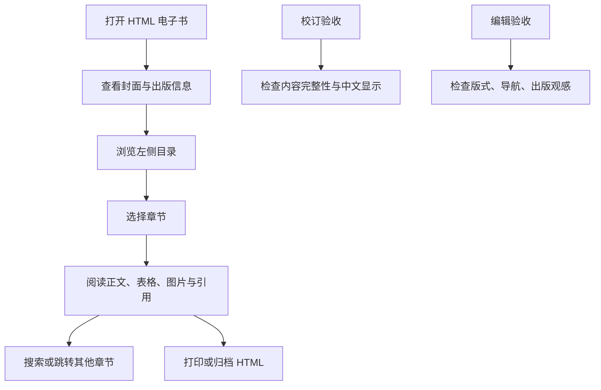

## 1. 产品概述
基于 `财商教育白皮书.agent.final.md` 生成单文件 HTML wiki 架构电子书，提供左侧目录、右侧分章节阅读、中文出版级排版、图文并茂阅读体验。
- 目标用户是需要阅读、校订、展示或分发《中产家庭子女财商教育白皮书》的作者、编辑与读者。
- 核心价值是在不引入外部内容的前提下，将长篇 Markdown 转化为可本地打开、可出版交付、可持续校验的 HTML 成品。

## 2. 核心功能

### 2.1 功能模块
1. **电子书阅读页**：封面、左侧目录、章节导航、正文阅读、表格优化、图片展示、引用区。
2. **阅读辅助系统**：章节进度、当前章节高亮、返回顶部、搜索、深浅阅读模式、移动端抽屉目录。
3. **出版级呈现系统**：中文字体栈、标题层级、脚注/引用样式、表格横向适配、打印样式、无障碍语义。
4. **验收机制**：独立校订检查、独立编辑检查、浏览器验证、内容来源约束检查。

### 2.2 页面详情
| 页面名称 | 模块名称 | 功能描述 |
|----------|----------|----------|
| 电子书阅读页 | 封面区 | 展示书名、副标题、来源说明、阅读入口；内容只来自源 Markdown 的标题与章节结构 |
| 电子书阅读页 | 左侧目录栏 | 自动从 Markdown 标题生成多级目录，支持当前章节高亮和滚动定位 |
| 电子书阅读页 | 章节正文区 | 按一级章节切分阅读，每章保留二级、三级、四级标题、段落、表格、图片、脚注引用 |
| 电子书阅读页 | 图文呈现 | 使用源 Markdown 中的图片引用；对关键章节生成非事实新增的结构化视觉卡片和阅读导图 |
| 电子书阅读页 | 检索与导航 | 支持本页关键词搜索、章节跳转、进度显示、返回顶部 |
| 电子书阅读页 | 打印/出版样式 | 针对 A4 打印优化标题分页、表格断页、脚注和链接显示 |

## 3. 核心流程
读者打开 HTML 后，从封面进入阅读；左侧目录常驻展示章节层级；点击目录定位到对应章节；阅读时当前章节自动高亮；遇到表格、图片、引用时以适合中文长文的出版排版展示；校订人员和编辑人员根据内置验收清单完成最终检查。

## 4. 用户界面设计

### 4.1 设计风格
- 色彩：以温润纸张色、深棕正文、金铜强调色为主，营造出版物与研究报告之间的质感。
- 字体：中文优先，标题采用宋体/思源宋体类字体栈，正文采用适合长文阅读的中文衬线字体栈，界面控件使用清晰的无衬线字体栈。
- 布局：桌面优先，左侧固定目录栏，右侧为宽度受控的章节阅读画布；移动端切换为抽屉目录。
- 图文：源图片原样嵌入；额外视觉只做结构化表达，不新增事实，不改变原文观点。
- 动效：克制使用目录高亮、搜索命中、章节进入等轻量过渡，避免影响长文阅读。

### 4.2 页面设计概览
| 页面名称 | 模块名称 | UI 元素 |
|----------|----------|---------|
| 电子书阅读页 | 左侧目录栏 | 书名、章节树、进度、搜索框、当前章节高亮 |
| 电子书阅读页 | 正文阅读区 | 封面、章节卡片、段落、表格、图片、引用、脚注 |
| 电子书阅读页 | 阅读工具条 | 搜索、主题切换、返回顶部、打印按钮 |
| 电子书阅读页 | 验收附录 | 校订验收、编辑验收、技术验收摘要 |

### 4.3 响应式
桌面优先；平板保持双栏布局但收窄目录；手机端目录变为顶部按钮触发的抽屉，正文单栏显示，表格支持横向滚动，中文正文不溢出。

### 4.4 验收标准
- 内容来源：正文内容仅来自 `财商教育白皮书.agent.final.md`。
- 内容完整：所有一级章节、主要标题、表格、图片引用、脚注区被保留。
- 中文支持：标题、正文、表格、脚注、搜索均正确显示中文，无乱码、无横向撑破。
- 出版观感：章节层级清晰、行宽适中、字距行距适合长篇阅读。
- 独立验收：至少经过一名校订视角和一名编辑视角检查，并记录修正项。
