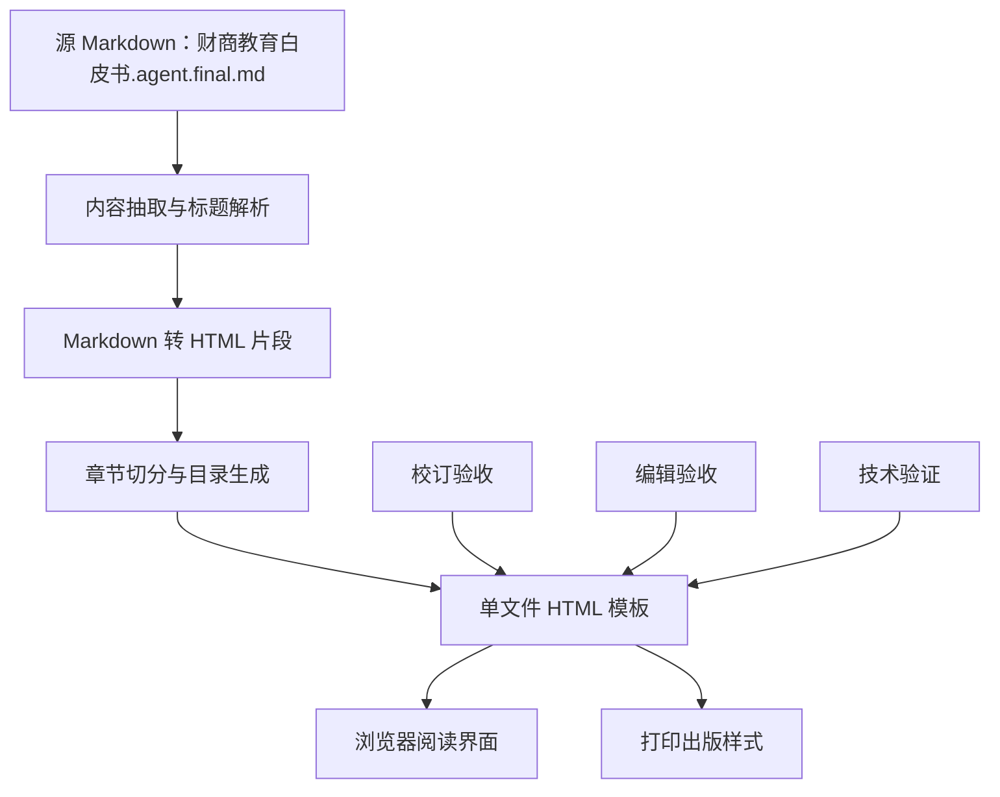

## 1. 架构设计
本项目交付一个可独立打开的静态 HTML 文件。内容抽取层只读取指定 Markdown；转换层负责 Markdown 到语义化 HTML；表现层提供 wiki 阅读布局、中文排版、目录交互、搜索与打印样式；验收层执行校订、编辑与浏览器验证。



## 2. 技术说明
- 前端：单文件 HTML + CSS + 原生 JavaScript。
- 内容源：仅使用 `财商教育白皮书.agent.final.md`，允许引用该 Markdown 中已经出现的本地图片路径。
- 生成方式：本地脚本读取 Markdown，生成 `财商教育白皮书_wiki_ebook.html`。
- 外部依赖：不依赖外部网络字体、CDN 或远程图片，确保本地打开稳定。
- 中文支持：`lang="zh-CN"`、`UTF-8`、中文字体栈、中文标点和长链接换行规则。
- 无障碍：语义化标题、导航区域、主内容区域、搜索输入标签、按钮可键盘操作。

## 3. 路由定义
| 路由 | 用途 |
|------|------|
| 本地 HTML 文件 | 直接打开完整电子书 |
| `#chapter-*` | 章节锚点跳转 |
| `#heading-*` | 二级及以下标题锚点跳转 |

## 4. 数据结构
### 4.1 章节模型
```typescript
type Heading = {
  level: 1 | 2 | 3 | 4;
  text: string;
  id: string;
};

type Chapter = {
  id: string;
  title: string;
  index: number;
  headings: Heading[];
  html: string;
};
```

### 4.2 验收模型
```typescript
type AcceptanceCheck = {
  role: "校订" | "编辑" | "技术";
  item: string;
  status: "通过" | "需修正";
  note: string;
};
```

## 5. 实现约束
- 不改写原文事实和观点，不补充外部材料。
- 允许增加阅读辅助元素，如章节摘要式导览、视觉卡片、进度提示，但这些元素必须由原文标题、表格或段落结构派生。
- 表格在窄屏下必须横向滚动，不压缩到不可读。
- 源 Markdown 中的图片必须保留并按出版样式呈现；缺失图片路径需在验收中标注。
- 生成文件应可直接双击打开，也应可通过本地 HTTP 服务打开。

## 6. 验收方案
- 校订验收：检查标题层级、正文完整性、中文字符、脚注引用、错位或乱码。
- 编辑验收：检查目录可用性、版式统一性、图文关系、表格可读性、出版观感。
- 技术验收：检查浏览器控制台、锚点跳转、搜索、移动端、打印样式和横向溢出。
