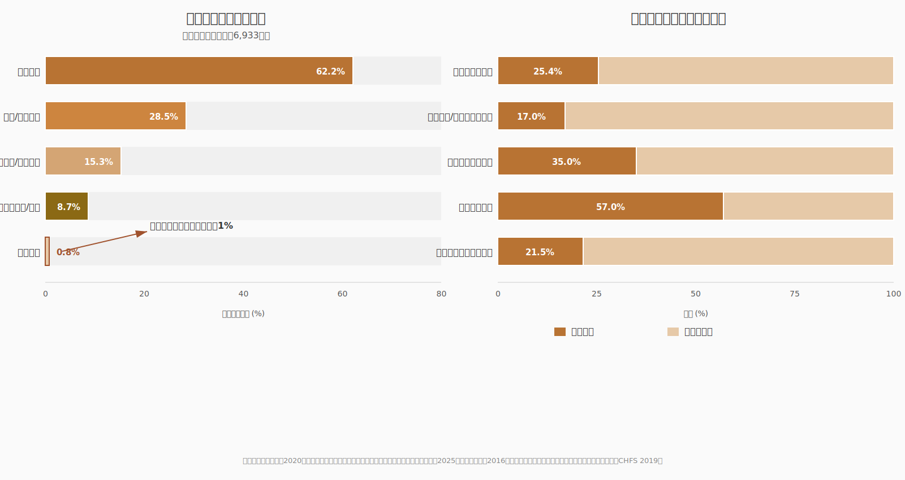

# 1. 现状与困境：中产家庭财商教育的数据真相

## 1.1 中国中产家庭的画像与焦虑

### 1.1.1 中产家庭定义与规模：被数据锚定的群体坐标

当我们谈论"中产家庭"时，首先需要回答一个基本问题：我们究竟在谈论谁？在流行话语中，"中产"是一个被过度使用又缺乏精确定义的标签。它有时指拥有房产和稳定薪水的城市白领，有时被等同于"焦虑的家长"这一文化符号。但如果我们希望为这一群体提供真正有效的财商教育方案，就必须先让数据为群体画像——不是用情绪，而是用可验证的指标。

从收入与资产维度看，中国中产家庭通常被界定为年收入15万至100万元、家庭净资产200万至1000万元的群体。[^1]这一区间覆盖了从一线城市的双职工专业技术人员家庭到二三线城市的中小企业主家庭，跨度不可谓不大。但正是这个群体的内部异质性，构成了财商教育需求分层的现实基础：年收入15万的家庭与年收入100万的家庭，在子女教育预算上存在近七倍的差距，二者对"财商教育可负担性"的理解天然不同。然而，无论处于这一区间的哪个位置，这些家庭共享一个核心特征：他们拥有足够的资源产生教育焦虑，却又没有充裕到可以忽视教育投入回报的程度。

这种"不上不下"的结构性位置，是理解中产教育焦虑的关键。上海交通大学高级金融学院的研究指出，中产阶层是教育问题上最为焦虑的群体——顶层家庭没有更高的基准点可设立，焦虑程度相对缓和；底层家庭无力设立中产基准线；中产阶层以顶层家庭为基准点，教育投入成为"保全现有地位、向顶层看齐"的核心手段。[^2]更精确地说，中产家庭拥有"足够负担但又不至于无痛"的经济条件，使其既具备教育军备竞赛的参赛资格，又承受参赛压力，成为这场竞赛中最脆弱的群体。[^3]

下表以多维数据勾勒出中产家庭的经济画像与教育投入现状。这些数据来自不同年份的权威调查，但趋势方向一致，足以勾勒出一个清晰的轮廓：中产家庭正在将大量资源投入子女教育，但投入的结构存在严重失衡。

**表1-1 中国中产家庭画像与核心数据**

| 维度 | 数据指标 | 数值 | 来源/年份 |
|------|---------|------|----------|
| 收入区间 | 家庭年收入 | 15-100万元 | 普遍定义 |
| 资产区间 | 家庭净资产 | 200-1000万元 | 普遍定义 |
| 教育支出 | 年人均教育支出 | 6,933元 | 刘保中，2018[^4] |
| 补习参与 | 子女课外补习参与率 | 62.2% | 刘保中，2018[^4] |
| 高额投入 | 年课外教育消费>1万元 | 78.9% | 艾瑞咨询，2016[^5] |
| 超高投入 | 年课外教育消费>2万元 | 52.3% | 艾瑞咨询，2016[^5] |
| 专项规划 | 子女教育专项财务安排 | 88.7% | 复旦FISF，2026[^1] |
| AI焦虑 | 担忧AI冲击需提前准备 | 79.7% | 复旦FISF，2026[^1] |
| 房产占比 | 家庭总资产中房产占比 | 69%-77% | CHFS，2019[^6] |
| 金融资产配置 | 金融资产占总资产比例 | 11.8%-20% | CHFS，2019[^6] |

这组数据揭示了一个耐人寻味的结构性特征：中产家庭在子女教育上的投入意愿几乎不存在预算约束——78.9%的家庭年课外教育消费超过1万元，超过半数超过2万元，近九成家庭为子女教育做了专项财务安排。然而，当我们将视线从"投入了多少"转向"投入了什么"时，一个巨大的盲区浮现出来：在这些精心规划的财务安排中，财商教育所占份额接近于零。这不是钱的问题，而是方向的问题。

### 1.1.2 教育焦虑的数据真相：从学业军备到AI恐慌

复旦大学国际金融学院2026年发布的一份报告，基于内地及港澳1900份中高净值家庭调研样本，为我们提供了一组令人警醒的数据：88.7%的家庭为子女本地教育做了专项财务安排，孕期到出生与本地教育的资金准备度超过85%，这是家庭财富流出最确定、最优先的通道。[^1]与此同时，超79.7%的家长认为需要为子女应对AI职场变化提前准备，双方均预判超三成工作将被AI替代，行政、销售、营运生产类成为高危领域。这种焦虑直接转化为财务需求：51.8%的家长将"为子女准备稳定收入支持"列为核心应对措施，希望通过长期确定的财务储备为子女打造职业风险的"安全垫"。[^1]

这些数字描绘了一个自相矛盾的图景：一方面，中产家长对子女教育的焦虑达到了空前高度，从学区房到一对一补习，从海外游学到竞赛培训，教育投入层层加码；另一方面，这种焦虑几乎完全指向"学业成功→名校→好工作"的传统线性路径，而对AI时代真正决定子女经济独立能力的财商素养——如何理解金钱的运行逻辑、如何做出理性的财务决策、如何在不确定性中管理风险——几乎毫无警觉。家长们在焦虑AI会取代孩子的工作，却很少思考AI无法取代的能力究竟是什么。答案是：AI可以替代执行标准化任务的白领，但很难替代具备独立财务判断、风险识别能力和创业思维的个体。讽刺的是，这些恰恰是财商教育的核心目标，也是当前中产家庭教育投入中完全缺失的维度。

更值得深思的是焦虑的代际传递机制。基于2022年全国8省市初中生家庭教育状况调查，骆婧雅与朱新卓的研究发现，中产阶层家长普遍呈现"高焦虑情绪、低教育参与"的特点：学业和身心健康是家长最为焦虑的内容，学业监管是家长最主要的教育参与行为，但真正意义上的亲子互动——包括关于金钱、决策、职业认知的对话——严重匮乏。[^7]家长的焦虑并非源于对教育价值的理性评估，而是源于"教育成层认知"——即教育被视为维持或提升家庭阶层地位的核心工具。这种认知将教育投入异化为一种防御性支出：我们投入不是为了创造，而是为了不被落下。

### 1.1.3 "高焦虑情绪、低教育参与"的结构性悖论

中产家庭教育的核心悖论由此浮现：我们投入巨大，但参与的方向完全错位。全国妇联家教指导中心在2021年的一份分析中尖锐地指出，中产阶层采取的"协作式养育"（concerted cultivation）确实使家长更多介入子女教育，但人们也需警惕"教育焦虑"成为"家长控制"。[^8]协作式养育本应是积极的——家长积极介入孩子的学校教育，提供校外教育资源，与老师建立积极联系。然而，当中产家长的焦虑过度膨胀时，协作便滑向了控制：孩子的一切被安排妥当，从课外班到才艺培训，从游学计划到竞赛路径，孩子只需执行，无需思考。

这种"高焦虑、低参与"的悖论在财商教育领域表现得最为极端。香港投资者教育委员会2021年的一项调查提供了一个令人警醒的参照：仅28%的香港家长专门安排时间与孩子讨论金钱事务，47%认为孩子应在小学或更早开始学理财，但高达14%坦言"完全不知道如何教孩子理财"。[^9]如果我们把这一发现迁移到内地语境——考虑到内地财商教育起步更晚、系统性更弱——实际比例可能更低。这意味着，绝大多数中产家庭在财商教育上的真实状态是：既不安排时间，也不具备方法，更缺乏意识。

但矛盾之处在于，中产家长并非不关心孩子的未来。相反，他们关心到了近乎偏执的程度。问题在于，焦虑的靶向完全错误。中产家长焦虑的是孩子能否考上重点中学、能否进入985高校、能否获得一份体面的工作，却很少焦虑孩子成年后会否因缺乏财务常识而陷入"校园贷"陷阱、会否因不懂复利而错失长期储蓄机会、会否因投资单一而在经济波动中遭受重创。这些焦虑的缺席不是因为这些问题不重要，而是因为它们不在中产家长的教育认知框架之内。正如一份研究报告所揭示的，虽然近年中国父母对财商教育普遍呈现出高度认可的态度，比重达到将近80%，但大部分家长对财商教育持"高认同、低认知、弱执行"的态度——他们知道财商重要，但不知道具体教什么、怎么教、何时开始。[^10]

这种认知与行动的断裂，正是本章试图打破的第一个迷思。我们接下来将用数据证明，中国财商教育的滞后不是态度问题，而是系统性缺位；不是个别家庭的疏忽，而是整个教育生态的结构性失衡。

## 1.2 财商教育的数据真相

### 1.2.1 中国财商教育在G20中的位置：第三层次的事实

如果我们把视野拉高到国际比较的维度，中国中产家庭财商教育困境的严峻性会变得更加清晰。2012年G20会议要求各参与国提供本国财商（金融）教育国家战略和实施情况，并将参与国由好到差分为三个层次。评估结果令人警醒：中国处于第三层次，落后于印度、印度尼西亚、韩国和泰国。[^11]这不是某个民间机构的排名，而是G20框架下的官方评估，反映的是国家战略层面的财商教育体系建设水平。

这一国际评估并非孤证。腾讯金融科技智库联合深圳大学发布的《亲子财商教育：国际比较与中国启示》报告显示，中国国民整体财商水平仅处于及格阶段，且不同城市间差异显著——北京、上海、江苏、广东等经济发达地区的整体财商水平较高，其他欠发达地区则更低。[^12]这种区域差异揭示了一个深层规律：财商教育的发展与经济水平并非简单线性相关，而取决于地方教育体系对财商教育的制度化接纳程度。即便在相对发达的地区，财商教育也停留在零星试点阶段，远未形成从幼儿园到大学的系统性教育链条。

与发达国家相比，中国的财商教育起步至少晚了十年以上。美国早在1994年已将财商教育纳入学校课程体系，英国2000年将理财和储蓄课程列为必修课，澳大利亚、日本等国也通过国家立法推动财商教育。[^13]而中国直到2013年才首次提出"加强投资者教育，逐步将投资理财教育纳入国民教育体系"——此时距离美国将财商教育纳入K-12体系已近二十年。这种时间差距造成的"财商鸿沟"，在中产家庭子女身上体现得尤为明显：当美国 teenager 在高中课堂上学习预算管理、信用评分和投资基础时，中国同龄人的财商知识来源几乎完全依赖家庭——而在下一个数据点中我们将看到，这恰恰是最脆弱的环节。

### 1.2.2 青少年财商能力数据：一场令人不安的"能力普查"

如果说国际比较揭示的是制度层面的滞后，那么青少年财商能力的微观数据则揭示了这种滞后正在结出怎样的果实。让我们直面一组令人不安的数据：和讯网2020年联合DATAICC发布的儿童财富价值观调研显示，83%的家庭给予零花钱但未建立任何管理机制，仅17%的家庭要求孩子通过劳动或任务换取零花钱；65%的儿童无法正确理解储蓄概念，认为"存钱就是把钱放在家里"。[^14]贾江楠与刘洁2025年在中华女子学院完成的家庭财商教育需求现状调查研究（覆盖224名全年龄层受访者，有效回收率95.3%）进一步发现，54.55%的18岁以下青少年从不记账，18至25岁青年中42.96%完全不懂"复利"概念，28.89%从未听说"风险分散原则"。[^15]

这些数字不是抽象的研究发现，它们描述的是我们身边绝大多数孩子的真实状态。一个每个月有400元零花钱的初中生，可能在游戏充值上花掉300元而不做任何记录；一个高中生可能从未想过为什么银行会给存款付利息，更不理解利息背后的复利逻辑；一个大学生可能在面对第一份信用卡账单时，才第一次意识到"最低还款额"意味着什么。这些场景并非假设，而是正在发生的日常。财商教育不是遥不可及的精英课程，而是每一个普通孩子日常生活所需的生存技能——但数据显示，我们正在系统性地剥夺孩子获得这些技能的机会。

上图以直观的方式呈现了这种结构性错配。左侧显示中产家庭的教育支出结构：62.2%的子女参加课外补习，才艺与素质培训、海外游学、教育硬件等投入层次分明，唯独系统性财商教育的参与率不足1%。右侧则展示了青少年财商能力的达标率：仅有25.4%的儿童具备理财规划意识，17%通过劳动换取零花钱，35%正确理解储蓄概念。将左右两图并置阅读，一个残酷的等式浮出水面：我们在孩子最不擅长的领域投入最少，在孩子最擅长的领域（应试）投入最多。这不是优化，而是错配。

**表1-2 青少年财商能力关键指标一览**

| 财商能力维度 | 达标比例 | 未达标比例 | 核心数据来源 |
|-------------|---------|----------|------------|
| 具备理财规划意识 | 25.4% | 74.6% | 知乎专栏，2023[^16] |
| 通过劳动/任务换取零花钱 | 17.0% | 83.0% | 和讯网，2020[^14] |
| 正确理解储蓄概念 | 35.0% | 65.0% | 和讯网，2020[^14] |
| 了解复利原理（18-25岁） | 57.0% | 43.0% | 贾江楠、刘洁，2025[^15] |
| 设立子女教育专项账户 | 21.52% | 78.48% | 贾江楠、刘洁，2025[^15] |
| 从不记账（18岁以下） | — | 54.55% | 贾江楠、刘洁，2025[^15] |
| 家庭仅拥有一种投资品 | 67.7% | — | CHFS，2019[^6] |

这张表格的每一行都在讲述同一个故事：中国青少年在财商能力上的集体性缺失。特别值得注意的两个数据是"83%家庭给予零花钱但未建立任何管理机制"和"仅17%家庭要求孩子通过劳动或任务换取零花钱"。前者揭示了财商教育的场景缺失——钱给了孩子，但没有任何规则、目标或反馈机制；后者揭示了财商教育的价值观缺失——孩子默认金钱来自父母的"给予"而非自身的"创造"，这从根本上扭曲了孩子对财富来源的认知。当一个孩子习惯了"伸手要钱"的模式，他成年后很难理解"价值创造→交换→回报"的经济逻辑，更遑论主动管理自己的财务生活。

### 1.2.3 教育投入的数据错配：资源流向了哪里

让我们回到中产家庭的教育投入数据，但这次用一个更锐利的视角来审视。艾瑞咨询2016年针对1015个中产家庭的调研显示，在过去一年里，78.9%的中产阶级家庭在子女课外教育上的年消费在1万元以上，超过半数的家庭在2万元以上，26.6%在3万元以上。[^5]普益集团2021年的白皮书进一步补充，每月在子女教育上花费超过1万元的中产家庭占比达19.84%，近五成中产家庭面临子女教育方面的经济压力。[^17]

这些数字本身并不令人意外——我们早已熟悉"中产到破产只有一个暑假"的叙事。真正令人意外、甚至令人震惊的是这些巨额投入的流向。在62.2%的课外补习参与率中，英语、数学、物理等学科培训占据绝对主导地位；在才艺培训中，钢琴、舞蹈、绘画、网球等"素质加分项"紧随其后；在海外游学和留学预备中，目标无一例外地指向提升升学竞争力。而在所有这些精心计算的投入中，财商教育的占比是多少？答案是：几乎为零。

这不是个别家庭的疏忽，而是整个中产教育消费市场的结构性盲区。财商教育市场虽然预计到2025年覆盖4.3亿人、市场规模达616亿元，但供给端存在严重的"内容同质化、渠道单一化、年龄适配性不足"问题：多数课程聚焦青年群体，忽视青少年零花钱管理等细分需求；教育形式多为单向灌输，与不同群体的学习偏好脱节。[^15]更根本的问题是，中产家长根本没有将财商教育纳入"教育投入清单"的意识。在他们的心智模型中，教育投入=学科培训+才艺培养+升学准备，财商教育不属于这个等式的任何一边。

这种错配的代价正在以隐形的方式累积。中国家庭金融调查（CHFS）2019年的数据显示，中国城市家庭财富管理整体处于"亚健康"状态，得分均值68.5分，38.1%的家庭得分低于60分；67.7%的中国家庭仅拥有一种投资品，而美国家庭拥有三种或以上投资品的比例高达61%。[^6]家庭金融资产组合风险呈现两极分化：46.2%的家庭风险值为0（只持有存款），14.7%的家庭风险值在0.24-0.3区间（高集中风险配置），中间地带几乎缺失。[^18]这种"要么极度保守、要么盲目冒险"的分化，正是财商教育缺位的直接后果——家庭缺乏对"风险-收益"关系的正确理解，无法根据自身风险承受能力进行合理配置。这不是成年后才出现的问题，而是童年时期财商教育缺失的延迟爆发。

## 1.3 结构性困境：为什么越投入越焦虑

### 1.3.1 教育军备竞赛的陷阱：投入从缓解焦虑变成制造焦虑

现在我们来到问题的核心：为什么中产家庭在教育上投入越多，焦虑反而越深？答案隐藏在一个被经济学和社会学反复验证的悖论中——当所有人都接受更高等的教育时，教育的"信号功能"便发生了通胀。社会学家兰德尔·柯林斯在《文凭社会》中提出的洞见，在今天的中产家庭教育中得到了残酷的验证：教育扩张本质上是一场"地位的零和博弈"。[^19]

中产家庭陷入了一个自我强化的焦虑循环。第一步，教育成层认知让中产家长相信教育是维持阶层地位的唯一通道；第二步，这种认知转化为对子女教育的高期望；第三步，对优质教育资源的竞争感知激活了焦虑情绪；第四步，焦虑驱动更多的教育投入；第五步，更多的投入并未带来差异化的竞争优势，因为所有人都同步加码；第六步，竞争平化导致焦虑进一步升级，进入下一轮循环。[^7]这个循环的致命之处在于，它让投入从"缓解焦虑"变成了"增加焦虑"的途径——你花越多，越觉得不够，因为别人的花费也在同步增加。

教育军备竞赛对财商教育的挤出效应尤为显著。在一线城市，家庭年均教育支出占可支配收入的30%以上，课外辅导占比超60%。[^20]当家庭预算被学科补习和才艺培训占据到如此程度，留给财商教育的时间和空间几乎不存在。更隐蔽的是心理层面的挤出：当家长每天被"孩子的作业做完了吗？""下次考试排名多少？"占据全部心智带宽时，他们根本没有余力去思考一个更根本的问题：我们培养孩子，究竟是为了让他们在考试中获胜，还是为了让他们在真实世界中生存？

"双减"政策后，一个更具讽刺意味的现象出现了：一对一补习反而成为中产家庭竞相追逐的新宠，有的家庭仅一个暑假就花费上十万元，一年投入五六十万元。[^21]这说明政策可以缓解过度竞争的外部环境，但无法根除中产家长内心深处的焦虑源头。只要"教育成层认知"不改变，只要家长仍然将教育视为阶层保卫战的武器，投入就会持续流向最能缓解短期焦虑的领域——学科成绩和升学竞争力——而财商教育这种"长期见效、短期无感"的投入，注定被边缘化。

### 1.3.2 代际传递的负向循环：父母是77%子女财商知识来源，但中国中年人财商水平倒挂

如果说教育军备竞赛解释了为什么财商教育被挤出，那么代际传递机制则解释了为什么即使中产家长意识到了财商教育的重要性，他们仍然难以有效实施。Lyons et al.（2006）的一项经典研究发现，几乎77%的高中生和大学生依赖父母获取金融知识。[^22]这意味着，在财商教育领域，家庭不是"重要渠道"之一，而是绝对主导渠道。学校系统在这一维度上的贡献微乎其微。

这个发现本身并不令人沮丧——家庭作为财商教育的主要场所，在理论上是一种高效的教育模式。真正令人沮丧的是中国中产家庭的现实：父母作为子女财商知识的主要社会化代理人，自身却普遍缺乏系统财商教育。标准普尔全球财商教育调查揭示了一个独特的"中国现象"：在发达国家，中年人财商教育水平通常高于青年人，因为中年人拥有更多金融实践经验；但在中国，情况恰好相反——中年人财商教育水平低于青年人。[^23]这一倒挂现象的成因不难理解：中国家长成长于一个金融工具极度匮乏、财商教育完全缺位的年代，他们从未接受过系统的金融知识训练，在房地产主导的财富积累模式下，对资产配置、风险管理、复利投资等现代财商概念的理解极为有限。

于是，一个负向循环形成了：父母财商有限→无法向子女传递有效财商知识→子女财商有限→下一代继续。Springer 2024年发表的一项实证研究提供了更具警示性的证据：父母若表现出负责任的财务行为（按时还款、理性消费），子女长大后更可能成为财务负责任的成年人；反之，父母经常透支的子女更可能模仿透支行为。[^24]心理科学进展的一篇学术综述进一步指出，经济态度和行为从父母向孩子的代际传递路径包括观察学习和亲子互动——孩子不仅听父母说什么，更看父母做什么。[^25]当中国中产家长自身的财务行为充满矛盾（一面过度节俭，一面又为孩子教育一掷千金；一面对投资讳莫如深，一面又期望孩子将来能"理财"），他们传递给子女的不仅是知识的匮乏，更是认知的混乱。

这种代际传递断裂在"金钱禁忌"文化中被进一步放大。中国家庭普遍回避与孩子谈论金钱问题——认为谈钱太俗气、孩子还小不懂。一旦涉及钱的具体话题，家长大多搪塞过去，从不做系统教导。这与犹太人"3岁识别货币、7岁阅读价格标签、11岁计算复利、13岁尝试安全投资"的体系化财商教育形成了鲜明对比。[^26]不是中国孩子比犹太孩子笨，而是中国家长从未获得过一个可以传递给孩子的财商知识体系。

### 1.3.3 从"协作培养"到"控制培养"：中产家庭教养方式的范式错位

中产家庭财商教育困境的第三个结构性维度，涉及教养方式的深层范式。全国妇联家教指导中心的研究指出，中产阶层家长采取的是一种"协作式养育"（concerted cultivation）模式：积极介入子女教育，提供丰富的校外教育资源，与老师保持密切沟通。[^8]这种养育模式在表面上是一种优势——它意味着中产家长愿意投入时间、精力和金钱来促进子女发展。但问题在于，当协作过度膨胀时，它会滑向"控制培养"（controlled cultivation）：孩子的一切决策由家长代劳，从日常生活（穿衣、吃饭、整理书包）到学业规划（选科、报班、填志愿）全部由家长决定，孩子沦为纯粹的执行者。

美国心理学记者Hara Estroff Marano在《A Nation of Wimps》中警告，父母的过度保护和干预限制了孩子发展应对生活不确定性和挫折所需的技能，反而使他们变得脆弱。[^27]这一判断在中国中产家庭中有独特的表现形式：家长试图通过掌控子女的学习和生活来阻止阶层滑落，但这种掌控恰恰剥夺了孩子最核心的能力——决策能力。财商教育本质上是一种决策教育：如何在有限资源中做出选择、如何评估风险与收益、如何在不确定性中承担后果并复盘。这些能力无法通过"听爸妈的话"来培养，而必须在真实的决策场景中反复锻炼。

胡润研究院2024年发布的《中国高净值人群家族教育报告》提供了一个参照性的对比：高净值家庭平均每个子女教育总投入近500万元，四分之一投入超过1000万元，但家庭最关注的培养目标并非考试成绩，而是领导力、创新力、协作力、判断力和分析力。[^28]高净值家庭通过家族办公室、导师计划、家族企业历练等结构化方式培养下一代财富管理能力，其核心逻辑是让孩子在真实场景中做决策、承担后果、复盘迭代。[^29]这与中产家庭"给卡不给事、给钱不给局"的模式形成了鲜明对照——中产家长给孩子消费额度，但不给参与家庭财务决策的机会；花钱让孩子参加社交活动，但不提供理解人际关系运作的引导。[^30]

这里需要澄清一个常见的误解：我们并非在主张中产家庭应该模仿富人家庭的天价教育投入。事实上，本书的核心命题恰恰是相反的——中产家庭的资源约束在财商教育上反而是一种筛选优势。真正需要从中产家庭向富人家庭教育方法论借鉴的，不是资金投入的规模，而是教育范式的本质转移：从"我为子女安排最好的"到"我让子女在真实场景中做选择"。当一项旅行预算的分配权交到孩子手中时，当一次家庭采购的决策过程被透明地讨论时，当孩子因为乱花零花钱而不得不承受月底无零食可买的后果时，财商教育就已经开始了。这些场景不需要500万元，甚至不需要500元——它们需要的是家长愿意放权、愿意让孩子犯错、愿意把每一次日常决策都变成教育机会的意识。

文军2018年的一项质性研究揭示了一个值得深思的现象：中产阶层父母确实以更加平等的姿态与孩子沟通交流，多采用鼓励和讲道理的方式，但在真实工作示范与职业认知传递方面存在不足。[^31]中产家长多为大企业白领、专业技术人员，工作内容高度抽象（PPT、报告、会议、邮件），不像蓝领工作那样有可视化的产出。同时，中产家长自身往往通过"应试—升学"路径获得现有地位，内心深处相信"成绩决定一切"，自然将这一逻辑复制到下一代。结果是，孩子看不到成年人在真实世界中的挣扎、妥协、创新与成长，缺乏应对复杂局面的心理模板。他们只知道"好成绩→好大学→好工作"的线性公式，却不知道真实职场中的复杂性、不确定性与灰色地带。当他们终有一天需要独立面对财务决策时，才发现学校没教、父母没示范、自己完全没有准备。

---

本章以数据为锚，勾勒了中国中产家庭财商教育的全景式困境。我们从88.7%的专项财务安排和79.7%的AI焦虑出发，看到了中产家长投入之巨；从G20第三层次的评估和83%的"给钱-花钱"循环，看到了财商教育滞后之深；从77%的代际传递依赖和62.2%的课外补习参与率，看到了错配之痛。但数据本身不是目的。我们之所以呈现这些数字，是为了让读者——每一位在深夜为孩子的补习费算账的家长——能够意识到：你的焦虑是真实的，你的投入是真诚的，但你的方向可能需要一次根本性的调整。

在下一章，我们将从"现状诊断"转向"认知框架"的建构。因为正如数据所揭示的，中产家庭财商教育的最大瓶颈不是资金，而是认知——父母自己也没有搞懂世界运行的规则，因此无法传递给子女。改变这一现状的第一步，是父母先升级自己的认知操作系统。

---

[^1]: 复旦大学国际金融学院《中产家庭子女全生命周期财富规划分析报告》. 2026. https://fisf.fudan.edu.cn/show-593-6812.html
[^2]: 上海交通大学高级金融学院，《为什么家长舍得在教育上花钱》. 2018-05-24. https://saif.sjtu.edu.cn/show-108-3919.html
[^3]: 智研咨询，《还没上学就花了27万，教育"减负"背后的真相》. 2018. https://www.51offer.com/article/detail_90747.html
[^4]: 刘保中，《"鸿沟"与"鄙视链"：家庭教育投入的阶层差异——基于北上广特大城市的实证分析》. 2018. http://sociology.cssn.cn/shxsw/shx_keyan/yjcg/xslw/201604/W020260428651746259766.pdf
[^5]: 艾瑞咨询《2016年中国中产家庭情况及教育现状》. 2016. http://jy.sentuxueyuan.com/?c=new_trade&m=down_pdf&id=48&pdfid=2038
[^6]: 中国家庭金融调查（CHFS），西南财经大学. 2019. https://chfs.swufe.edu.cn/__local/1/4B/0D/1205E9EED7140E549FCC440CE5B_46F704E2_BDD654.pdf
[^7]: 骆婧雅、朱新卓，《中产阶层家长教育焦虑是如何形成的？——基于8省市初中生家庭教育状况的调查》. 2024. http://mp.weixin.qq.com/s?__biz=MzI2MDYwNjE4Mg==&mid=2247491507&idx=1&sn=c313682ff1cac783a1a23f4ad6d51757
[^8]: 全国妇联家教指导中心，《多元视角，带你看家庭教育焦虑》. 2021-06-15. https://www.ccc.org.cn/art/2021/6/15/art_50_28409.html
[^9]: 香港投资者教育委员会《Parenting & Money Study 2021》. 2021. https://www.ifec.org.hk/web/common/pdf/about_iec/parenting-&-money-study-2021.pdf
[^10]: 《亲子财商教育报告》，经济观察网. 2018. http://m.eeo.com.cn/2018/0604/329622.shtml
[^11]: OECD/G20 财商教育层次评估. 2020. https://pdf.dfcfw.com/pdf/H3_AP202006081383110184_1.pdf
[^12]: 腾讯金融科技智库联合深圳大学《亲子财商教育：国际比较与中国启示》. 2018. https://www.sohu.com/a/331322796_470634
[^13]: 凤凰网《发达国家财商普及率高达60%》. 2021. https://i.ifeng.com/c/89p3W62eeGF
[^14]: 和讯网《2020中国儿童财富发展现状及未来》. 2020. https://pdf.dfcfw.com/pdf/H3_AP202006081383110184_1.pdf
[^15]: 贾江楠、刘洁，《家庭财商教育需求现状调查研究》. 中华女子学院，2025. https://pdf.hanspub.org/ae_1881259.pdf
[^16]: 知乎专栏《2023中国儿童财商教育现状观察》. 2023. https://zhuanlan.zhihu.com/p/635405610
[^17]: 普益集团《2021中国中产家庭资产配置白皮书》. 2021. https://chengzhaoxi.xyz/download/pdf/report/【普益集团】2021中国中产家庭资产配置白皮书.pdf
[^18]: 中国家庭金融调查（CHFS）家庭金融资产组合风险分析. 西南财经大学，2019. https://chfs.swufe.edu.cn/__local/1/4B/0D/1205E9EED7140E549FCC440CE5B_46F704E2_BDD654.pdf
[^19]: 虎嗅，《中产家庭真正的消费陷阱》. 2026-01-12. https://www.huxiu.com/article/4825436.html
[^20]: 王春昊/新东方前途出国，《高考生=负债人，家长的教育投资到底投的是什么》. 2026. https://liuxue.xdf.cn/blog/blog_7828873.shtml
[^21]: 艺飞说/搜狐，《一年花掉50万中产们卷起天价一对一》. 2024-08-05. https://www.sohu.com/a/798761708_99990677
[^22]: Lyons et al., Parental Norms and Financial Education. Academies. https://www.abacademies.org/articles/Attitude-towards-money-mediation-to-money-management-1528-2635-21-1-106.pdf
[^23]: 《经济观察报》"如何让孩子获得未来财务成功？". 2018. http://m.eeo.com.cn/2018/0604/329622.shtml
[^24]: Springer《Life in Perpetual Overdraft》. 2024. https://link.springer.com/content/pdf/10.1007/s10834-024-10013-9.pdf
[^25]: 心理科学进展《经济态度和行为的代际传递现象及机制》. https://www.sciengine.com/doi/pdfView/0955A20164E84E98BA092B2884C11ADA
[^26]: 搜狐《真正的富人如何对孩子进行财商教育？》. 2017. https://www.sohu.com/a/206134978_99951891
[^27]: Hara Estroff Marano, *A Nation of Wimps*. https://quod.lib.umich.edu/cgi/p/pod/dod-idx/nation-of-wimps.pdf
[^28]: 胡润研究院《2024中国高净值人群家族教育报告》. 2025. https://www.hurun.net/zh-cn/info/detail?num=P4IRU6QS6RIX
[^29]: Wrisse《家族办公室中教育的作用》. 2025. https://www.wrise.com/zh-hans/%E5%B8%82%E5%9C%BA%E6%B4%9E%E5%AF%9F/%E5%AE%B6%E6%97%8F%E5%8A%9E%E5%85%AC%E5%AE%A4%E4%B8%AD%E6%95%99%E8%82%B2%E7%9A%84%E4%BD%9C%E7%94%A8/
[^30]: 本地参考文件：富人家庭教育实操指南 / 1.md（内部项目资料）
[^31]: 文军，《文化资本代际传递的阶层差异及其影响》. 华东师范大学学报，2018. https://xbzs.ecnu.edu.cn/CN/html/2018-4-101.htm
